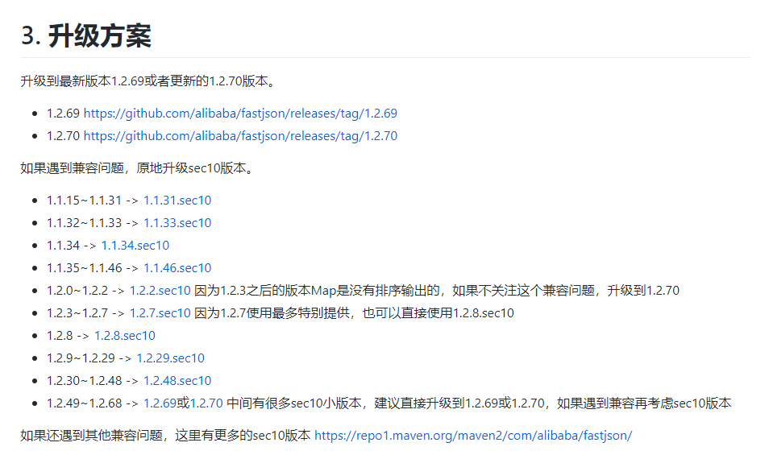

fastjson-study

## 背景

fastjson 1.2.68 版本爆出高危漏洞，本次通过寻找改漏洞触发机制来学习 fastjson 的安全机制

[安全漏洞通告](https://github.com/alibaba/fastjson/wiki/security_update_20200601)

## bug 追踪

### 查看 bug 如何被修复

升级到 *.sec10 可解决问题

### 下载代码查看修改点

1.2.8 到 1.2.8.sec10 改动较小，增加了一个 denyHashCodes，三个 exceptClass (并将 exceptClass 替换为 exceptHash)

下载 source.jar 解压获取源码 (已解压放到 fastjson-source-code 文件夹下)

[fastjson-1.2.8-sources.jar](https://repo1.maven.org/maven2/com/alibaba/fastjson/1.2.8/fastjson-1.2.8-sources.jar)

[fastjson-1.2.8.sec10-sources.jar](https://repo1.maven.org/maven2/com/alibaba/fastjson/1.2.8.sec10/fastjson-1.2.8.sec10-sources.jar)

1. 在 ParserConfig.denyHashCodes 中添加了 0xD59EE91F0B09EA01L

通过广大网友的暴力破解 [fastjson-blacklist](https://github.com/LeadroyaL/fastjson-blacklist)

得到 0xD59EE91F0B09EA01L 为 oracle.jms.AQ

但黑名单需要开启 autoType 才能使用，所以该重大漏洞与 oracle.jms.AQ 无关

2. exceptClass 替换为 exceptHash 并添加了3个

通过源码分析，使用 TypeUtils.fnv1a_64 遍历 java 标准库的类名得到新增加的 3个 exceptHash 为

- java.lang.Runnable
- java.lang.Readable
- java.lang.AutoCloseable

能绕过 autoType 限制大概率于这三个类有关

